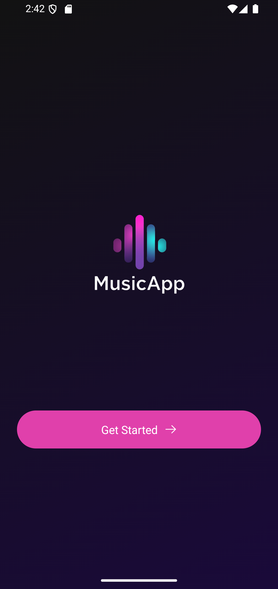
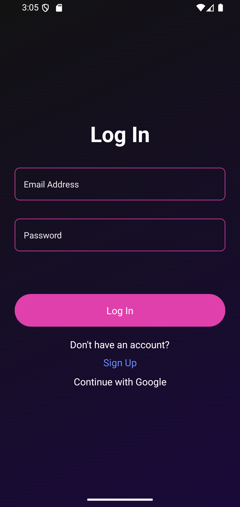
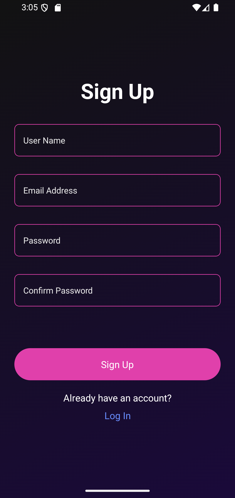
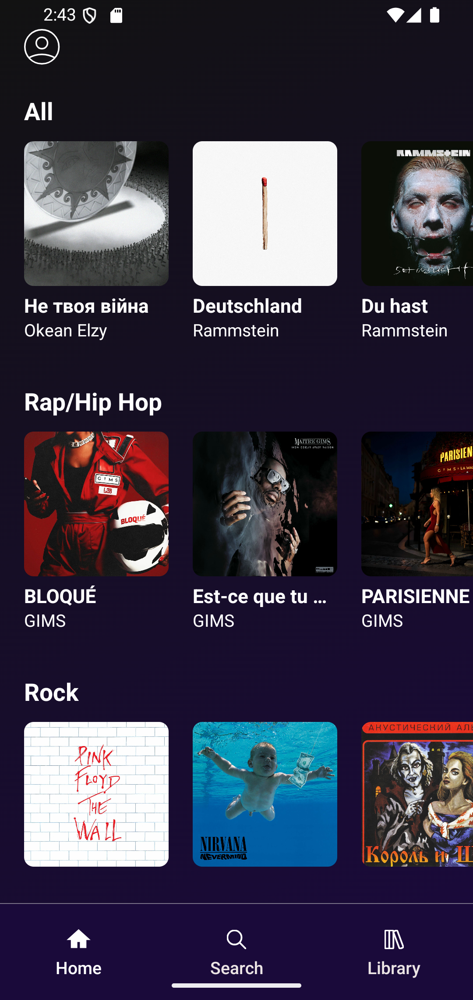
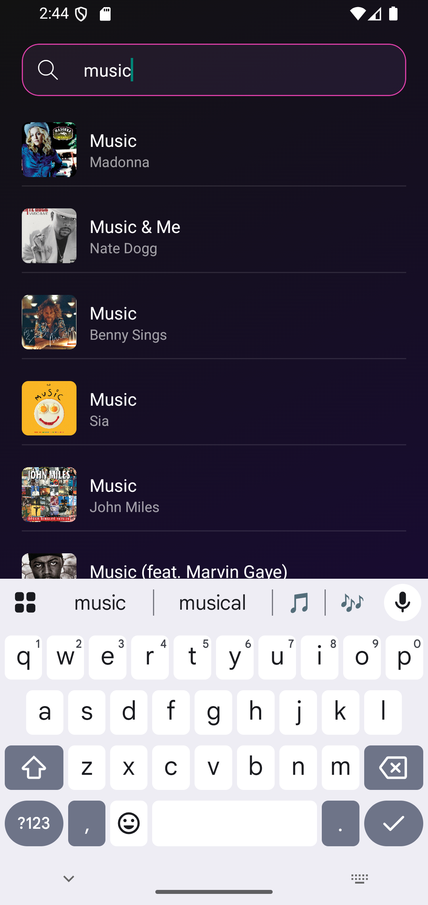
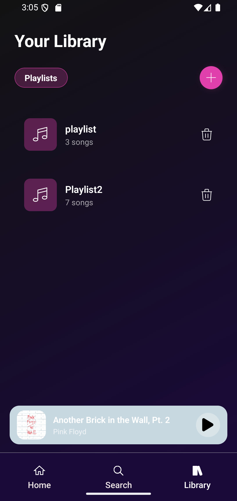
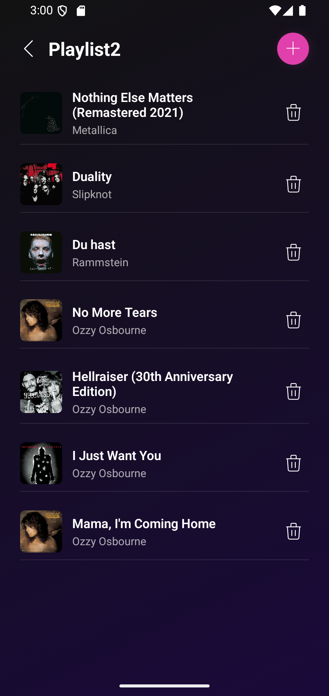

# Welcome to Music App  👋

## Features

- Browse popular tracks and genres  
- Listen to track previews  
- Search for tracks in real-time  
- Create and manage playlists  
- Add/remove tracks from playlists  
- Persistent state for playlists  
- Smooth UI with animations and responsive design

  ## Screenshots

> The project is still in development. Here are a few screenshots of the current progress:

### Get Started Screen


### Login Screen


### Signup Screen


### Home Screen


### Track Screen


### Search Screen


### Your Library Screen


### Playlist Screen


## Tech Stack

- **React Native** & **Expo**  
- **TypeScript**  
- **Zustand** for state management  
- **Axios** for API requests  
- **Deezer API** for music data  
- **React Hook Form** + **Zod** for form handling and validation  
- **Expo AV** for audio playback  
- **Expo Linear Gradient, Blur** for UI enhancements   
- **React Native Modal**
- **Toast Message** for user feedback  
- **Firebase** (Authentication & Firestore) for user management and data storage

  

## Get started

1. Install dependencies

   ```bash
   npm install
   ```

2. Start the app

   ```bash
   npx expo start
   ```


